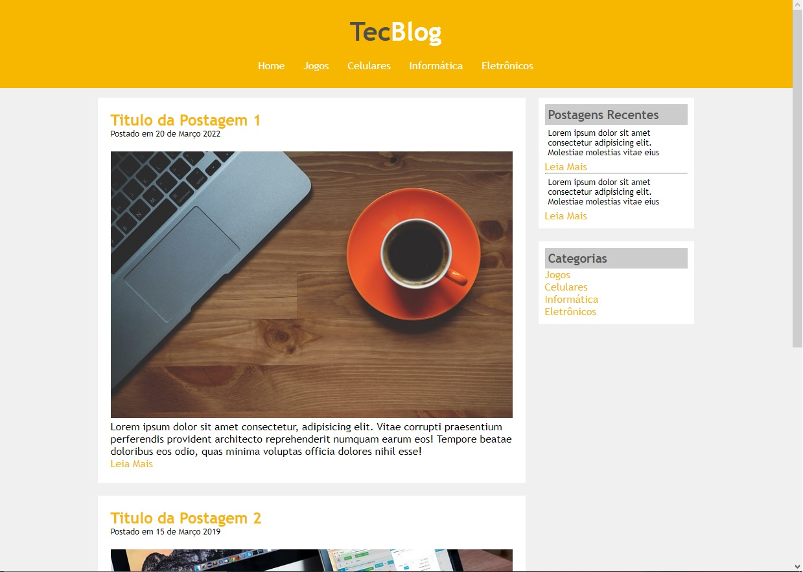

<h1 align="center"> 
  ✔️Site Notícias da Cidade✔️
</h1>

## 💻 Sobre o projeto

Projeto feito para aplicar novos conhecimentos adquiridos sobre HTML e CSS

## :dart: Objetivo do Projeto

```bash
Praticar os conhecimentos adquiridos sobre HTML5 e CSS

-Praticar conhecimento sobre float em CSS
-Utilizaçao de novas tag em HTML

```

## :pager: Tela principal da Site UNES 

 

 # 👷 Como rodar

```bash
# Clonar o repositório
git clone https://github.com/cleuber-andrade/Projeto_TecBlog.git

# Entrar numa IDE de sua preferência 

# Executar o servidor ou usar um puglin que criar um servidor

```

Feito isso, abra o seu navegador e acesse `http://localhost:5500/`
ou em uma porta de sua preferência.

 ## 🤔 Como contribuir <br/>

- Faça um fork desse repositório; <br/>
- Cria uma branch com a sua feature: `git checkout -b minha-feature`;<br/>
- Faça commit das suas alterações: `git commit -m 'feat: Minha nova feature'`; <br/>
- Faça push para a sua branch: `git push origin minha-feature`.<br/>
<br/>
Depois que o merge da sua pull request for feito, você pode deletar a sua branch. <br/>


## :mortar_board: Autores

<table align="center">
    <tr>
        <td align="center">
            <a href="https://github.com/cleuber-andrade">
                
                <br />
                <sub><b>Cleuber Andrade</b></sub>
            </a>
        </td>    
    </tr>
</table>
<h4 align="center">
  By  <a href="https://www.linkedin.com/in/cleuber-andrade-b8955420b/" target="_blank"> Cleuber Andrade </a>
</h4>


